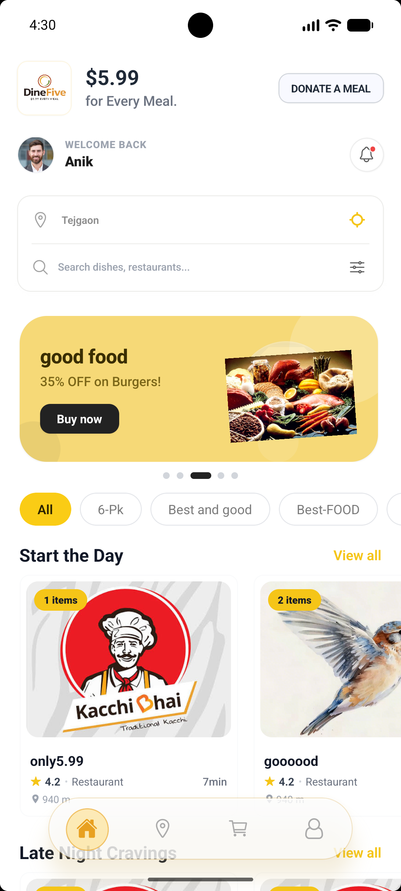
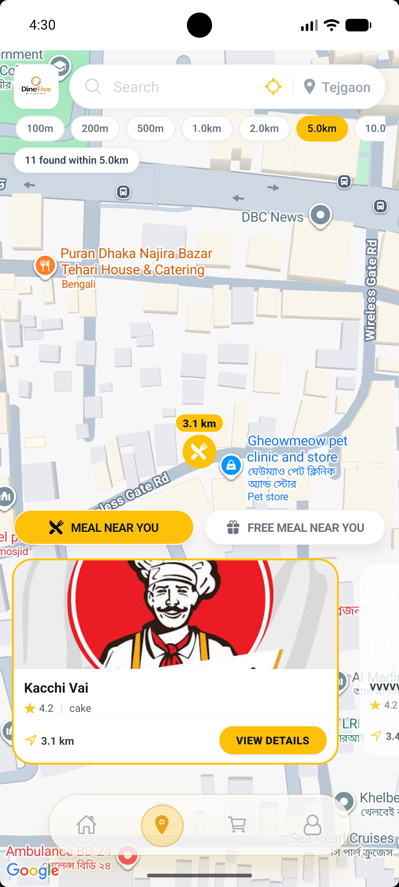
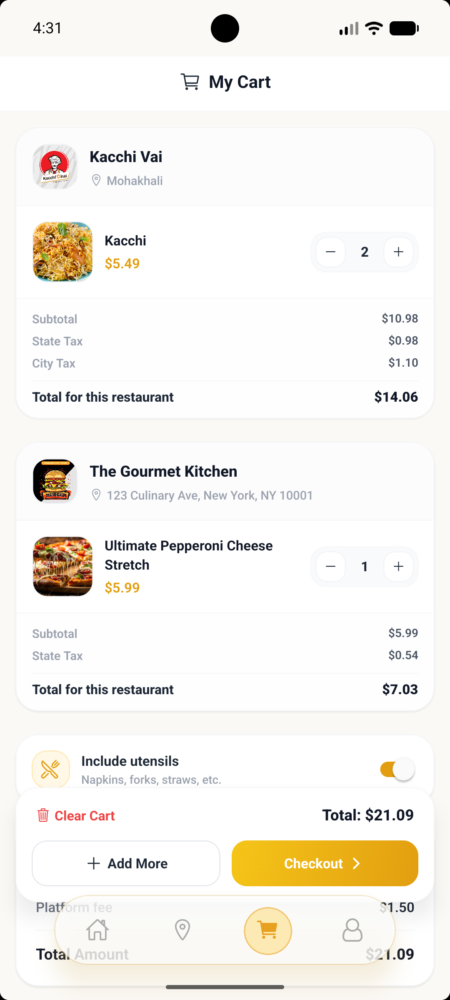
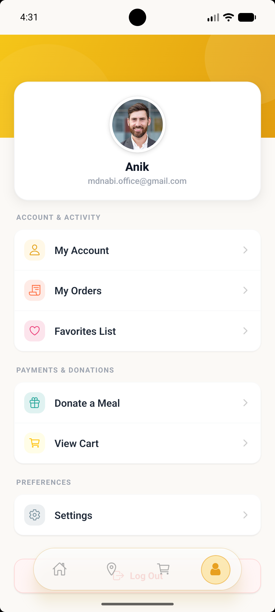
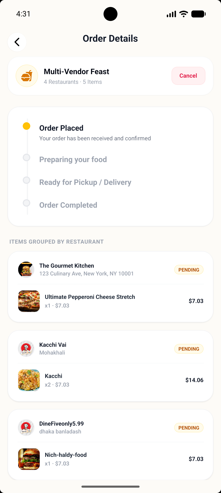

# Dine-Five

Dine-Five is a premium, mobile-first food ordering app built with Expo, React Native, and Expo Router. It delivers a seamless, high-performance user experience, featuring customer onboarding, secure authentication, location-based restaurant discovery, menus, shopping cart management, Stripe checkout, past orders history, and favorites list.

---

## 📱 App Screenshots

<p align="center">
  
  
  
  
  
</p>

---

## 🚀 Key Features

- **Interactive Home Dashboard:** Features a dynamic 2-line location and food searchcard, category filters, rolling banners, and nearby restaurant lists.
- **Location-Aware Discovery:** Dynamically detects coordinates using Expo Location, resolving exact labels, or lets users search and enter addresses manually.
- **Optimized Menus & Food details:** Interactive tabbed menus with scroll synchronization, adding and managing quantities, and product rating/reviews.
- **Favorites with Quick Cart Action:** Custom favorites list with interactive heart icons for toggling and a one-tap `"Add to Bag"` CTA.
- **Secure Authentication:** Complete email/password signup and login flow with OTP verification, reset passwords, and Google Sign-In support.
- **Stripe Payment Sheets:** Unified Stripe sheet checkout workflow for secure billing, supporting tokens and orders.
- **Profile & Settings Management:** Interactive profile settings, customer support tickets, and account settings (Danger Zone options like Delete Account/Logout).

---

## 🛠️ Tech Stack

- **Core Framework:** Expo 54, React Native 0.81, React 19
- **Navigation:** Expo Router (File-based routing)
- **Styling:** NativeWind & Tailwind CSS (Utility-first CSS styling)
- **State Management:** Zustand with AsyncStorage (Persisted user credentials, authentication token, and cart state)
- **Native Module Integrations:**
  - Expo Location
  - Expo Notifications & Sync Hooks
  - React Native Maps (with Web fallback)
  - Stripe React Native SDK
  - Google Sign-In SDK

---

## 📁 Project Structure

```text
app/                Route groups, pages, navigation layouts, and sub-screens
components/         Reusable UI components for auth, home, cart, map, and profile flows
stores/             Zustand stores managing auth state, restaurant feeds, carts, and orders
services/           Third-party integration services (e.g. Stripe, location)
hooks/              App-level hooks (e.g. notification synchronization, event listeners)
utils/              API handlers, helpers, and shared utilities
assets/             Icons, static banners, screenshots, and visual assets
```

---

## ⚙️ Getting Started

### Prerequisites

- **Node.js:** 18 or newer
- **npm** (Package manager)
- **Emulators/Simulators:** Android Studio (Android) and/or Xcode (iOS) for native verification.
- **Backend URL:** Working instance of the Dine-Five API server.

### 1. Install dependencies

```bash
npm install
```

### 2. Configure Environment Variables

Create a `.env` file in the root directory of the project and specify your backend endpoint URL:

```env
EXPO_PUBLIC_API_URL=backend_api_url
```

- **Note:** LAN and Emulator host redirects are automatically handled in `utils/api.ts` when running against a local development backend.

### 3.Prebuild the Project

```bash
npm expo prebuild --clean
```

### 4. Start the Project

```bash
npm expo run --device
```

You can also run platform-specific commands directly:

```bash
npm run android    # Run Android development build
npm run ios        # Run iOS Simulator
npm run web        # Run in Web browser
```

---

## ⚖️ License

This project is licensed under the [MIT License](LICENSE).
